<p align="center">
  
</p>

<p align="center">
  
  
  
  
  
</p>

Grafana dashboards for Kubernetes, built while debugging real clusters.

Each dashboard starts from a question an engineer asks during an incident ("why won't this pod schedule?", "is it CPU, memory or the network?") rather than from a list of available metrics. Every panel has a tooltip that explains it, and every dashboard comes with a troubleshooting playbook.

---

## Dashboards

| Dashboard | What it answers | Preview |
|---|---|---|
| **[Kubernetes Capacity & Bottlenecks](dashboards/k8s-capacity-bottlenecks/)** | Why is my pod `Pending`? Which node is full, and full of what: CPU, memory or pod slots? Which workloads over-request, get throttled, or are about to be OOMKilled? Is it the network? | <a href="dashboards/k8s-capacity-bottlenecks/"></a> |

More dashboards are on the way. ⭐ Star the repo to follow along.

---

## Quick start

1. Open the dashboard's folder and download its `.json` file.
2. In Grafana, go to **Dashboards → New → Import** and upload the file.
3. Choose your Prometheus data source and click **Import**.

Each dashboard's own README covers its requirements, how to provision it as code (sidecar ConfigMap or the Grafana API), and how to read it during an incident.

---

## Design principles

- **Question-first.** Rows are ordered the way you debug: overview, then where the pressure is, then which workload, then the network.
- **Scheduler-aware.** Requests, allocatable capacity and real usage appear side by side. The scheduler uses requests, so usage alone never explains a `Pending` pod.
- **Portable.** No hard-coded data source UIDs. The data source is a dashboard variable, so the JSON imports cleanly into any Grafana.
- **Explained.** Every panel carries a description tooltip, and every dashboard has a playbook that maps symptom to panel to fix.

---

## Repository layout

```
.
├── README.md                          ← you are here
├── LICENSE
├── assets/
│   ├── banner.svg
│   └── social-preview.png             ← link-card image for LinkedIn / social
└── dashboards/
    └── k8s-capacity-bottlenecks/
        ├── README.md                  ← dashboard docs + troubleshooting playbook
        ├── k8s-capacity-bottlenecks-dashboard.json
        └── screenshots/
            └── overview.png
```

Every dashboard gets its own folder with the same layout. GitHub renders the folder's `README.md` when you open it.

---

## Contributing

Issues and pull requests are welcome, whether that's a new dashboard, a panel for a common bottleneck, or a fix for label differences between Prometheus setups.

## License

[MIT](LICENSE)

## Author

**[sarangacharya](https://github.com/sarangacharya)** · DevOps / Platform Engineer · [LinkedIn](https://www.linkedin.com/in/<your-linkedin-handle>)
