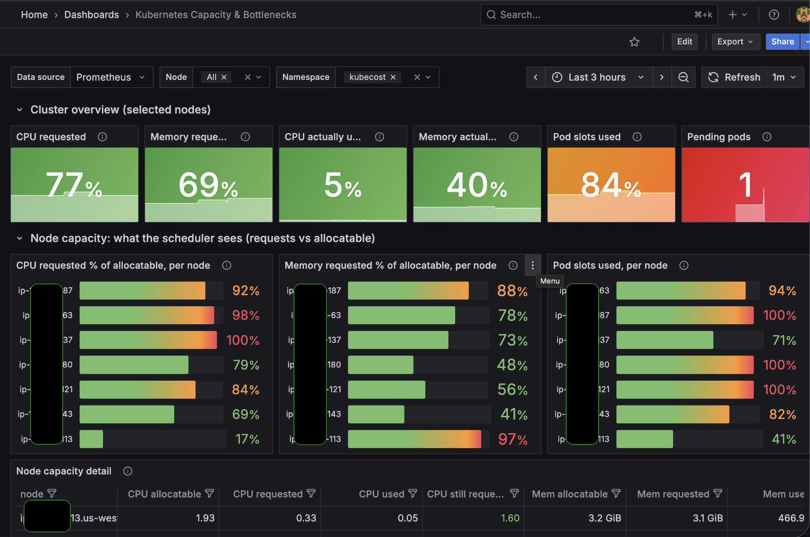
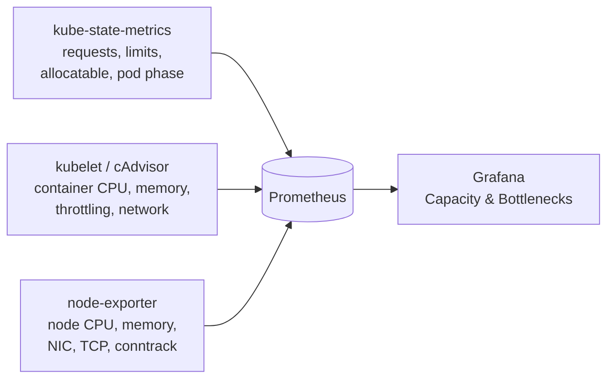

[← All dashboards](../../README.md)

# Kubernetes Capacity & Bottlenecks


A single Grafana dashboard that answers the questions you actually ask during an incident:

- **Why is my pod stuck in `Pending`?**
- **Which node is full, and full of what: CPU, memory or pod slots?**
- **Which pods reserve far more than they use, and which use more than they reserve?**
- **Is this a resource problem or a network problem?**



> **What this capture shows:** the cluster has **77% of its CPU requested but only 5% actually used**, several nodes sit at **100% of their pod slots**, and one pod is stuck in `Pending`. The cluster is full of *reservations*, not load. This dashboard makes that gap visible at a glance.

**Download:** [`k8s-capacity-bottlenecks-dashboard.json`](k8s-capacity-bottlenecks-dashboard.json)

---

## Why this dashboard exists

The Kubernetes scheduler places pods using **requests vs. allocatable**, not actual usage. A node can sit at 20% real memory usage and still reject new pods with `Insufficient memory`, because other pods have already *reserved* the rest.

Most dashboards show either reservations or usage. This one puts **what the scheduler sees** next to **what the node is really doing**, so the gap between the two is obvious. It also adds throttling, OOM and network signals, which covers the usual reasons a workload is slow or unstable.

```
0/6 nodes are available: 2 Insufficient cpu, 3 Too many pods, 6 Insufficient memory.
```

With this dashboard open, the error above takes seconds to explain rather than a round of `kubectl describe node`.

---

## What's inside

| Row | Panels | Answers |
|---|---|---|
| **Cluster overview** | CPU/memory requested %, CPU/memory actually used %, pod slots used %, pending pods | How much headroom do I really have? |
| **Node capacity (scheduler view)** | Per-node CPU requested %, memory requested %, pod slots used %; node table with **"still requestable"** CPU and memory; pending pods with their requests | Why won't this pod schedule, and which node is closest to fitting it? |
| **Node actual load** | Real CPU and memory utilisation per node (node-exporter, includes system daemons) | Is the node actually busy, or just heavily reserved? |
| **Pods** | Requests, limits, usage, used/request %, CPU throttling, memory % of limit, restarts; top-10 charts for CPU, memory, throttling and OOM risk; restarts with termination reason | Which workloads are over-provisioned, throttled, or about to be OOMKilled? |
| **Network** | Top pods by RX/TX, pod and node drops/errors, node NIC throughput, TCP retransmission rate, conntrack table usage | Is it the network: saturation, packet loss, or connection-tracking exhaustion? |

Filters: **Data source**, **Node** (multi-select), **Namespace** (multi-select).

---

## How it works



---

## Requirements

| Component | Why it's needed | Example metrics |
|---|---|---|
| **Prometheus** | Data source for every panel | — |
| **kube-state-metrics** v2+ | Requests, limits, allocatable, pod phase, restarts | `kube_pod_container_resource_requests`, `kube_node_status_allocatable` |
| **kubelet / cAdvisor** scrape | Real container usage, throttling, pod network | `container_cpu_usage_seconds_total`, `container_memory_working_set_bytes` |
| **node-exporter** | Real node load, NIC, TCP and conntrack stats | `node_network_receive_bytes_total`, `node_nf_conntrack_entries` |
| **Grafana** 10+ | Dashboard rendering | — |

[kube-prometheus-stack](https://github.com/prometheus-community/helm-charts/tree/main/charts/kube-prometheus-stack) ships all of the above out of the box.

**Quick check:** run this in Grafana Explore. You should get a non-zero count for every metric:

```promql
count by (__name__) ({__name__=~"kube_pod_container_resource_requests|kube_node_status_allocatable|container_cpu_usage_seconds_total|container_memory_working_set_bytes|node_uname_info|node_nf_conntrack_entries"})
```

> **Note:** don't point this dashboard at a tool's bundled, purpose-built Prometheus (for example Kubecost's). Those usually keep only the metrics the tool needs, so some panels will be empty. Use your main cluster Prometheus.

---

## Installation

### Option 1: Import through the Grafana UI

1. Download [`k8s-capacity-bottlenecks-dashboard.json`](k8s-capacity-bottlenecks-dashboard.json).
2. In Grafana, go to **Dashboards → New → Import**.
3. Upload the file, pick your Prometheus data source, and click **Import**.

### Option 2: Provision as code (Grafana sidecar / kube-prometheus-stack)

If your Grafana runs the dashboard sidecar (the default in kube-prometheus-stack), any ConfigMap with the `grafana_dashboard: "1"` label is loaded automatically.

```bash
curl -sSLO https://raw.githubusercontent.com/sarangacharya/grafana-dashboards/main/dashboards/k8s-capacity-bottlenecks/k8s-capacity-bottlenecks-dashboard.json

kubectl create configmap k8s-capacity-bottlenecks \
  -n <grafana-namespace> \
  --from-file=k8s-capacity-bottlenecks-dashboard.json \
  --dry-run=client -o yaml \
| kubectl label --local -f - grafana_dashboard=1 -o yaml \
| kubectl apply -f -
```

To manage it from Helm, GitOps or CI/CD, redirect the output to a file (`> k8s-capacity-bottlenecks-cm.yaml`) and commit that instead of piping it to `kubectl apply`.

> The sidecar only watches the namespaces it's configured for (`sidecar.dashboards.searchNamespace` in the Grafana Helm chart). Put the ConfigMap in one of them.

### Option 3: Grafana HTTP API

```bash
curl -sSL https://raw.githubusercontent.com/sarangacharya/grafana-dashboards/main/dashboards/k8s-capacity-bottlenecks/k8s-capacity-bottlenecks-dashboard.json \
| jq '{dashboard: ., overwrite: true}' \
| curl -sS -X POST "$GRAFANA_URL/api/dashboards/db" \
    -H "Authorization: Bearer $GRAFANA_TOKEN" \
    -H "Content-Type: application/json" \
    -d @-
```

---

## Troubleshooting playbook

| Symptom | Where to look | What it usually means / what to do |
|---|---|---|
| Pod stuck `Pending`: `Insufficient cpu` / `Insufficient memory` | **Pending pods** table, then compare its request with **CPU/Mem still requestable** in **Node capacity detail** | No node has enough *unreserved* capacity. Add nodes, use a larger instance type, or reduce the request. If the request is bigger than an **empty** node's allocatable, adding more nodes of the same size will not help. |
| `Too many pods` | **Pod slots used, per node** | The node hit its max-pods limit. On EKS this comes from ENI/IP limits; enable VPC CNI prefix delegation or use larger instances. |
| Nodes "full" but barely used | High **Memory requested %** with low **Node memory utilisation** | Workloads over-request. Use **used / req** in the Pods table (blue = under 30%) to right-size. |
| Latency spikes while node CPU looks idle | **Top 10 CPU-throttled pods** | The CPU limit is too low. Raise or remove the CPU limit for that workload. |
| Containers restarting | **Restarts (24h)** table (`OOMKilled` in red) and **Containers closest to their memory limit** | Memory limit too low, or a memory leak. |
| Pod evictions under load | **Mem used / req** above 100% together with high **Node memory utilisation** | Pods use more than they reserve, and the kubelet evicts under node memory pressure. Raise memory requests. |
| Random connection timeouts | **Conntrack table usage**, **TCP retransmission rate**, **Node network drops and errors** | Conntrack table exhaustion, packet loss, or NIC saturation. |

---

## Notes and limitations

- **Node filter on node-exporter panels** matches the Kubernetes node name against the host's `nodename`. That holds for default EKS names (`ip-10-x-x-x.<region>.compute.internal`); with custom hostnames, those panels only filter correctly when **Node = All**.
- **Numbers look doubled?** kube-state-metrics is probably scraped twice. Add `job="kube-state-metrics"` to the KSM selectors.
- **Scheduling reasons** (`FailedScheduling` messages) are Kubernetes *events*, not metrics. Ship them to Loki (for example with Grafana Alloy's Kubernetes events source) if you want them on a panel.
- **Single-cluster Prometheus assumed.** For a multi-cluster backend (Thanos, Mimir, etc.), add a `cluster` variable and a `cluster=~"$cluster"` matcher to each selector.

---

## Customising

- **Thresholds:** every panel uses Grafana thresholds (for example orange at 80% and red at 95% for requested %). Adjust them to your team's SLOs.
- **Network interfaces:** node NIC panels match `eth*|ens*|enp*|eno*`. Edit the `device=~` matcher if your nodes name interfaces differently.
- **Rate window:** queries use `[5m]`. Shorten it for faster reaction, lengthen it for smoother graphs.

---

## Roadmap

- [ ] EKS ENA allowance panels (`bw_in/out_allowance_exceeded`, `pps_allowance_exceeded`, `conntrack_allowance_exceeded`) via node-exporter's ethtool collector
- [ ] Kubernetes events panel (FailedScheduling, evictions) via Loki
- [ ] Optional `cluster` variable for multi-cluster Prometheus backends

---

[← All dashboards](../../README.md) · [MIT License](../../LICENSE)
